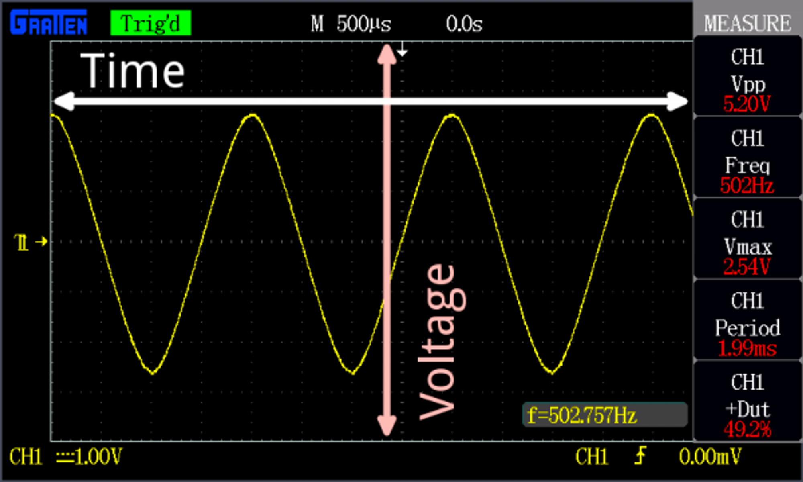
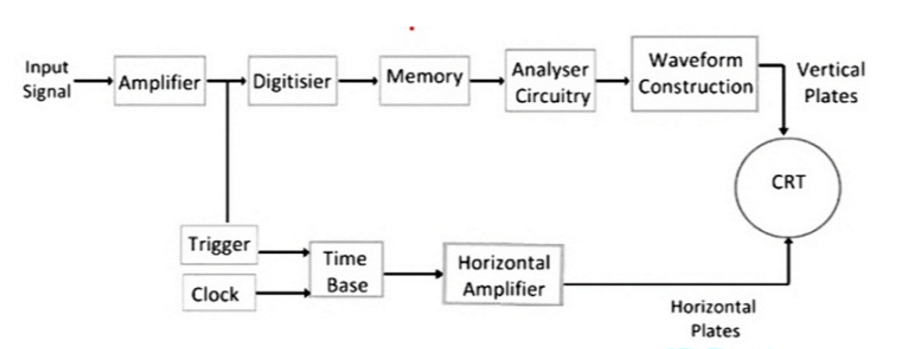

# 1. Introduction

Last Monday at the laboratory we were learning how to use an oscilloscope and signal generator. We observed signal shapes, configured income signal and measure signals such as: frequency, magnitude, phase shift, period and average value.

## Theoretical introduction

An oscilloscope, formerly known as an oscillograph, is an instrument that graphically displays electrical signals and shows how those signals change over time.

There are two types of oscilloscopes: analog and digital. An analog oscilloscope captures and displays the voltage wave form in its original form, while a digital oscilloscope uses an analog-to-digital converter to capture and store information digitally. (When it comes to debugging and design, most engineers today use digital oscilloscopes.)

### A brief history

The oscilloscope was invented by a French physicist[André Blondel](https://en.wikipedia.org/wiki/Andr%C3%A9_Blondel) in 1893. His device was able to register the values of electrical quantities such as alternative current intensity. An ink pendulum attached to a coil recorded the information on a moving paper tape. The first oscilloscopes had a very small bandwidth, between 10 and 19 kHz.

### ****How Does an Oscilloscope Work?****

To fully understand the experiments with oscilloscope we have to know how it works.

First of all, an oscilloscope is a combination of various small parts.But, there are four parts that are the most important among all. These are

- CRT
    - In an oscilloscope, the cathode ray tube is used to display a graph of the voltage or current at a given point in time. The voltage is applied to the cathode, and the ammeter measures the current. The electrons are then accelerated towards the anode, and the voltage controls the beam’s intensity. This creates a beam of electrons that scans the screen from left to right, and the beam’s intensity is proportional to the current.
- Vertical control
    - A vertical control in an oscilloscope adjusts the voltage displayed on the screen. The height of the waveforms determines this voltage on the screen. The higher the waveforms, the higher the voltage. The vertical control allows you to adjust the voltage to match the waveforms on the screen.
- Horizontal control
    - Horizontal control allows the oscilloscope to display a single horizontal line on the screen. It can be used to adjust the timebase, which is the time it takes for the oscilloscope to draw a single horizontal line on the screen. This is measured in milliseconds (ms) and can be adjusted by turning the horizontal control knob.
- Triggering control.
    - Triggering in an oscilloscope controls the timing of the waveform display. The waveforms are displayed in the time domain, so triggering is used to control the start and stop times of the waveforms. Triggering is also used to control the acquisition of data.

Digital oscilloscopes work by sampling voltage at a fixed rate and displaying the voltage waveforms on a digital screen. The voltage waveforms are displayed as a series of dots representing the voltage amplitude at a specific point in time. The oscilloscope samples the voltage waveforms at a fixed rate and calculates the average voltage between the samples. This process is repeated for every sample, and the resulting waveform is displayed on the oscilloscope’s screen.

# 2. Experiment setup

# 3. Experiment results

# 4. Conclusion